# 绪论

1. 安全通信的三要素：
   1. 机密性，双方要传递的信息不能被第三方看到，可以通过将明文加密解决。
   2. 报文完整性，不会被篡改。 可以通过数字摘要+数字签名的方式来解决。
   3. 端点鉴别，通信双方能够证实另一方的身份。不能冒充身份。可以通过消息认证码或数字签名解决。
   4. 防止事后否认，这里不包括恶意的第三方。       可以通过数字签名解决。
2. 互联网上使用的加密和解密算法都是公开的，通信双方具有第三方所没有的，就是密钥。
3. 对称密钥系统：发送方和接收方使用相同的密钥进行加密和解密。如何安全地分发密钥是一个重要问题，一般采用线下的方法。对称加密的密钥是由一方生成，然后发送给另一方。
4. 公开密钥系统：使用不同的密钥进行加密和解密，公钥能解密私钥加密的数据，私钥也能解密公钥加密的数据。每个人都有一对公钥和私钥。看起来是一种天衣无缝的方法，但是有两个缺点：
   1. 第三方虽然不可以解密内容，但是可以对密文进行胡乱修改，接收方收修改后的到密文，并不能判断密文的是否被修改过。
   2. 效率比对称密钥系统低。
5. 银行卡密码，手机密码更多地可以看做是口令。
6. 通过密码来鉴别身份。一个好的密码算法是除了秘钥都应该公开。
7. 最早的密码可以看做是语言和行为。不同动物之间的语言互不相同。
8. 但以上都不是为了加密而产生的，最早的加密用的密码是巫师发明的。很长一段时间一直用在军队上。
9. 明文 plaintext       密文 ciphertext
10. 密码的功用：①保密性，对明文加密。②身份认证和信息完整性鉴别（电子信息的篡改非常容易）③不可否认性，身份唯一性认证，不可伪造性（由于签名不可伪造，因此可以认为一旦发现签名，必定是某人签下的）④可用性好，加密容易，解密难。
11. 密码是进行明文→密文转换的符号。对“明文”进行“加密”得到"密文"。有明文空间和密文空间。
12. 研究“加密”和“解密”的方法称为密码学。
13. 滚筒密码是人类第一个有记载的密码。将纸缠绕在滚筒上，然后书写，传输，只有使用同样大小的圆通才可以解读。本质是置换。
14. 凯撒密码（古罗马古埃及时代），例如英文字母A→C，B→D等，本质是替换。
15. 发展到现代，密码学的两大基本方法也是替换和置换。
16. 香农1949年发表论文《安全系统的通信理论》证明了一次一密是最安全的，不过也是最没用的。
17. 1976年美国国家标准局发布DES Data Encrypted system（IBM设计），第一个民用的密码，一种分组密码，把64个比特转化为64个比特。与此同时，公钥密码的思想也产生了。1978年，第一个实用公钥密码体制RSA。
18. 当时颁布DES时，计划使用10年，但是10年后经过论证评估，又继续使用了10年，1997年，AES（Advanced Encrypted system）诞生。
19. 指纹，虹膜，人脸属于生物密码。
20. 现在密码学的分类：
    1. 按照密钥个数分为无密钥，单密钥，双密钥密码。
    2. 按照每次加密的比特个数分为序列密码（又称为流密码，1个）和分组密码（多个）。
    3. 根据接收方和发送方所使用的密钥是否相同分为对称密码和非对称密码。
21. hash函数类似于人的指纹，只要指纹不同，就不是同一个人。两个文件的hash值相同，则认为是同一个文件。有意识地去寻找两个hash值相同的不同文件，是可不能的。
22. 扔硬币就是一个随机数生成器。最好的密钥来自随机数。单向函数，大数分解。
23. 分类：
    1. 无密钥
       1. Hash函数
       2. 随机数生成器
       3. 单向函数

    2. 单密钥
       1. 对称加密
       2. 消息鉴别码

    3. 双密钥
       1. 公钥加密
       2. 数字签名

24. 无密钥的例子：一个箱子，同时可以有两个锁锁住，发送方先把信息放入箱子，用自己的锁锁上，送给接收方，接收方收到后，用自己的锁锁上，然后再发给发送方，发送方再把箱子上的自己的锁解开。再把箱子送给接收方，此时接收方打开箱子，去除信息。                  每个人只知道自己的密钥，但是这个从算法上还没有做到。
25. 单密钥的例子：一个箱子，同时只能有一个锁锁住，但是钥匙有两个一样的，分别放在发送方和接收方处。
26. 双密钥的例子：一个箱子，同时只有一个锁锁住，但是上边还有一个投递口（类似于意见箱，只能进不能出）。此时发送方要给接收方传递信息，首先向接收方申请一个箱子，这个箱子上加了接收方的锁。发送方收到箱子后，把消息放进去，然后把箱子给接收方，接收方打开去除信息即可。
27. 密码协议规定了密钥的生成传递。
28. 保密性由对称和公钥加密负责。完整性由Hash函数，消息认证码，数字签名负责。认证性由消息认证码，数字签名，身份鉴别负责。不可否认性由数字签名负责。
29. 被动攻击：窃听。主动攻击：修改信息。
30. 在外网和内网之间使用U盘，容易导致机密文件泄露，机密机房使用U盘要写保护。
31. 网站被黑客篡改，把用户倒向黑客设计的钓鱼网站。
32. 可以为数字文件（图片和视频中含有大量冗余信息）加上数字版权标示，加入前后，数字文件的品质不会受到明显影响。

# 古典密码

1. 替换（代换）密码：将明文中的一个字母用其他字母或符号代替。

2. 置换密码：将明文字符按照某种规则重新排列。（换序）

3. 二者的区别：替换密码的明文和密文所含的字母可能不同，而置换密码明文和密文所含的字母是相同的，只是顺序不同而已。

4. 转轮密码是用机械方法实现的最好的密码之一。

5. 凯撒密码又称为移位密码。密钥就是替换表。

   ```
   abcdefghijklmnopqrstuvwxyz
   DEFGHIJKLMNOPQRSTUVWXYZABC
   ```

6. 数学描述：这里k=3。$c=E(p)=(p+k)\mod{} (26)$。$p=D(c)=(c-k)\mod{}(26)$。

7. p是明文$∈Z_{26}$，c是密文$∈Z_{26}$，，k是密钥∈[1,25]，只有25个。

8. 仿射密码是移位密码的扩展。密钥是两个数，$k=(a,b)∈Z_{26}\times Z_{26}$，且$gcd(a,26)=1$​最大公约数为1，即互质，这样要求的目的是为了使得解密后的结果唯一。当a=1,b=3时，就是凯撒密码。

   ```shell
   #加密
   c=E(p)=(a x p + b) mod 26
   #解密
   c=D(c)=(c - b) x a^-1 mod 26
   ```

9. 此时$a^{-1}$为a的逆，不是$\frac{1}{a}$，它表示和a相乘对26取余结果为1的数。

10. 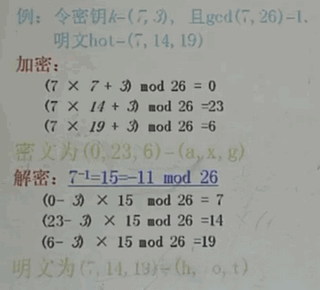

11. 单表代密码，代换表是26个字母的任意置换。

12. 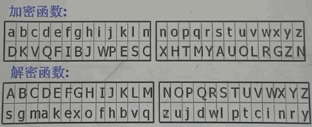

13. 多表代换密码，使用多个代换表，而单表代换密码，从始至终使用一个密码表。

14. 简化的多表代换密码：维吉尼亚密码，由26个类似于凯撒密码的代换表组成。

15. 维吉尼亚密码：在长为m的密码种，任何一个字母可被映射为26个字母中的一个。明文$p\in (Z_{26})^m$，密文$c\in (Z_{26})^m$，密钥$k\in (Z_{26})^m$。

    1. 加密过程：$c=(p_1+k_1,\cdots,p_m+k_m)\mod{}26$。

    2. 解密过程：$p=(c_1-k_1,\cdots,c_m-k_m)\mod{}26$。

16. 多表代换密码由分组密码的意思。之前的都可以看做是序列密码。

17. 置换密码：信息的元素只有位置变化，形态没有变化。可以打破消息中的某些固定的结构（结构）。

18. 可以用置换矩阵来表示置换操作，每行每列有且只有一个1，其他都是0。

19. 用于分组密码，先分组， 明文和密文都是m长度的字母串，密钥空间是定义在1，2，3，……m上的一个置换$\Pi$（一共有m!个）。每个置换都有唯一的一个逆置换（逆矩阵）。

20. 加密：$c=(p_{\Pi(1)},p_{\Pi(2)},\cdots,p_{\Pi(m)})\mod{}26$。解密： $p=(c_{\Pi(1)}^{-1},c_{\Pi(2)}^{-1},\cdots,c_{\Pi(m)}^{-1})\mod{}26$。

21. 例如：

    ```
    x    1 2 3 4 5 6
    ∏(x) 3 5 1 6 4 2
    
    x       1 2 3 4 5 6
    ∏^-1(x) 3 6 1 5 2 4
    ```

22. Hill密码：把置换矩阵扩展成了任意可逆矩阵，置换密码可以看做是希尔密码的特例。密钥空间变大。明文和密文都看做是行向量。$c=p*K \mod{} 26$，$p=c*K^{-1}\mod{}26$​。

23. 例子：$K=\begin{bmatrix}11&8\\3&7\end{bmatrix}$，$K^{-1}=\begin{bmatrix}7&18\\23&11\end{bmatrix}$，$p=(9,20)$，则$c=p*K\mod{}=(3,4)$。

24. 希尔密码安全性较差，通过若干的明文和密文对就可以倒推密钥矩阵。

25. 转轮密码机是一种用于加密解密的机械，根据齿轮的半径不同进行置换。速度快，稳定。古典密码的电封。

26. 惟密文攻击是难度最大的。已知密文攻击是知道若干或无穷对明文密文对。最常用的是统计（频率）攻击。

27. 移位密码，仿射密码和单表代换密码都没有破坏明文的频率统计规律。可以使用统计分析法。

28. 人类的语言都有特点，存在冗余。

29. 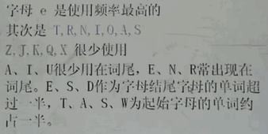

30. 密码分析的5种情形：
    1. 惟密文攻击：破译者只知道加密算法和带破译的密文。攻击难度最大。
    2. 已知明文攻击：破译者知道加密算法和多个明文-密文对。
    3. 选择明文攻击：破译者知道加密算法，和他自己选定的明文对应的密文。公钥密码体制中，破译者可以构造任意明文对应的密文。理论上可以采用穷举法把所有的明文都加密一遍，然后对照找出密文对应的明文。
    4. 选择密文攻击：破译者知道加密算法，还知道他自己选定密文对应的明文。
    5. 选择文本攻击：是选择明文攻击和选择密文攻击的结合。

31. 一个密码体制是安全的，通常是指在前三种攻击下的安全性，即攻击者一般容易具备进行前三种攻击的条件。

32. 攻破一个密码是指获取密钥，进而能够解密任意密文，同时也能加密任意明文。

33. 双字母，三字母出现的概率从高到低排序。

34. 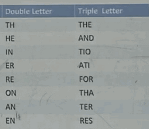

35. 现代密码和古典密码的基本假设不相同。破译者知道的信息不同。

36. 密码学的信息论基础

37. 香农-信息论之父，1948年发表《通信的数学理论》奠定了现代信息论的基础。1949年发表《安全系统的通信理论》定义了保密系统的数学模型。

38. 密钥源空间应该足够庞大，防止暴力破解。安全信道的带宽非常低，不能用来传递信息。

39. 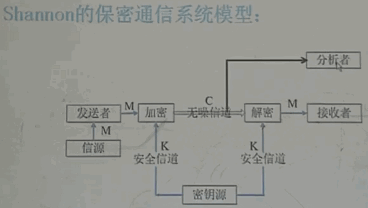

40. 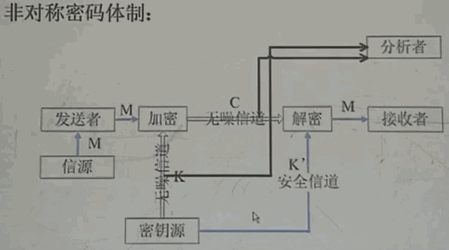

41. 加密密钥和解密密钥不一样，从加密密钥中得不到任何关于解密密钥的信息，反之亦然，解密密钥只有接受者知道，发送者都不知道。非对称密码体制中，加密密钥可以公开，任何人都知道。选择明文攻击。

42. K和K'一一对应，理论上知道K就可以求出K'，但是实际上可能要花很长时间或很大代价。

43. 一个密码体制是一个六元组：

    ```
    (P，C，K1，K2，E，D)
    其中：
        P是明文空间
        C是密文空间
        K1是加密密钥空间
        K2是解密密钥空间
        E是加密变换
        D是解密变换
    ```

44. 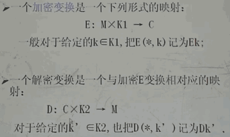

45. 任意明文进行加密和解密（使用相对应的加密和解密密钥）后都能得到原来的明文。顺序不能颠倒。如果先解密再加密还可以得到原文，则可以还用来做数字签名。

46. 对于任一$k\in K_1$，都能找到$k'\in K_2$，使得$D_k(E_k(m))=m$，$\forall m\in M$。

47. 用熵来描述信息量

48. 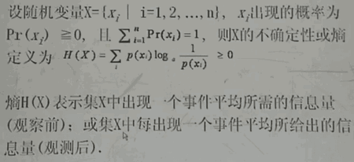

49. 互信息：知道Y之后，X的不确定性减少量。

50. 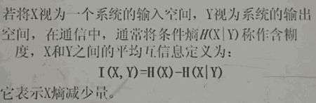

51. 绝对安全（完善保密）的密码系统满足：$I(P,C)=0$。即知道密文后，并不会减少明文的不确定性。

52. 比特流模2加密就是绝对安全的。需要密钥是绝对随机的，实际中并不存在。任何实用的密码都无法证明是绝对安全的。

53. 一次一密系统，该算法早在1917年用于报文消息的自动加密和解密中，30年后由香农证明它是不可攻破的。

54. 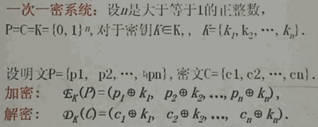

55. 使用迭代结构，对加密过的内容再进行加密，其实无法从理论上证明多加密一次就更安全。如果密码体制不是幂等（$F^2=F$）的，那么多次迭代有可能提高安全性。

56. 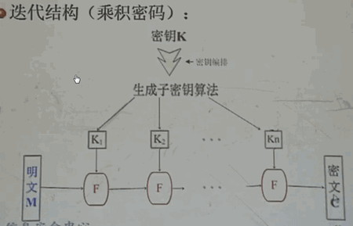

57. 具有混淆（明文和密文的关系复杂）和扩散（明文和密钥的每一个比特都影响着密文的每一个比特）的特点。扩散又称为雪崩效应，即明文和密钥有一点点变化，则密文会变化很多。

58. 密码设计中，要假设破译者具有已知的最先进的理论和手段。

59. 用复杂度理论来讲密码的破译和已知的难题对比，看它和哪一种级别的难题相当。

60. 背包问题：能否找到一组数之和等于一个已知的数，如果可以是那些数？

    1. 设$A=(a_2,a_2,\cdots,a_n)$是由n个不同的正整数构成的n元组，S是另一已知的正整数，A称为背包向量，S为背包容器，求A的子集$A'$，使得$\Sigma_{a_i\in A'}a_i=S$。

    2. 设背包向量$A=(1,2,5,10,20,50,100)$，背包容积为177，求向量$X\in \{0,1\}^7$，使得$\Sigma x_ia_i=177$。

61. 素数问题和素分解问题。密码问题中，数会达到$2^{1024}$的量级。

    1. 已知整数N，问N是否是一个素数，如果不是求N的素分解式。

62. 背包问题是一个问题，它含有参量。如果参量为具体数值时，即给定背包向量，求权重，这是问题的一个实例。

63. 判定问题：回答只有yes或no。例如：判定一个数是否是素数。

64. 计算问题：从可行解的集合中搜索出最优解，例如求一个数的素分解。

65. 算法复杂度：要考虑时间（主要操作的步骤），空间（所需要的存储单元的数目，数据复杂度（信息资源）。

66. 不能简单地将一次除法看做是一样的，因为大数相除和小数相除是完全不同的。使用确定性图灵机来衡量复杂度，即用确定性图灵机来实现算法，看复杂度是多少。

67. 计算模型--确定性图灵机（有限带符号集合，有限状态集，转换函数）（读写头，读写带）

68. 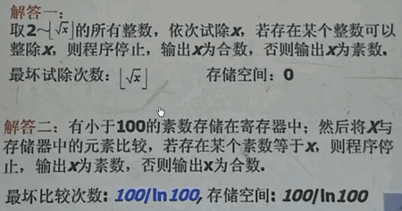

69. 到目前为止数学家没有找到一个多项式时间内的算法来判定一个数是否是素数。即对于一个形如$a^n$的数，无法在$n^b$时间内判定其是否是素数。

70. 已经证明素数是无穷多的，素数的分布也不知道。

71. 不同的编程语言，不同的编译器导致执行一次操作的时间各不相同，通常假设所有计算机执行相同的一次基本操作所需时间相同，而把算法中基本操作执行的**最大次数**作为执行时间。

72. 时间的衡量不是真实时间而是数量级的衡量。

73. 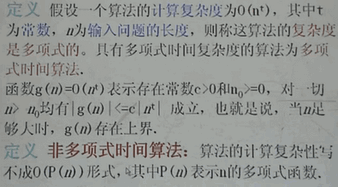

74. 多项式存在同阶的上界。

75. 如果一个密码体制，存在多项式时间的破译算法，则它是不安全的。

76. 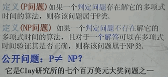

77. 背包问题是NP问题，素数分解问题无法判定是P问题还是NP问题。

78. 安全是相对的，不安全是绝对的。在有效期内，可能的计算能力。从商业角度分析，破译成本（随着技术的发展，一直变低）要比保护的信息的价值高，这才是好的密码体制。破译密码系统的时间要超过被加密信息的有效声明周期。

79. 无法判定NP问题是否是P问题，因此可以认为是NP问题是安全的。

80. 密码系统的设计：对于合法用于来说，解密应该在多项式时间内完成；对于攻击者来说，破解应该在非多项式时间内完成。

# 分组密码

1. 序列密码多用于军队，分组密码多用于民间。
2. 分组密码属于对称密码体制，每次对固定长度的一段内容进行加密和解密。
3. DES和AES都是美国的，我国不允许商用。不过由于银行系统和国际接轨较早，它其中的卡还是这些算法。中国开发了自己的加密标准SMS4。
4. 现代密码体制的明文空间都看作是比特串，这样可以兼容文本，图像，视频等信息。
5. 分组密码主要用于数据保密性，但是进行修改也可以用于签名和认证。
6. 分组密码的加解密速度比非对称密码快，比序列密码慢。能够足够实时传输音视频。非对称密码达不到这样的速度，因此一般是采用非对称密码传递对称密码的密钥，然后使用对称密码来进行通信。
7. 分组密码还有其他应用：可用于构造伪随机数发生器，流密码，认证码，哈希函数。也有使用电噪音来生成随机数的。
8. 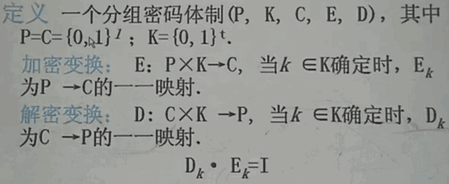
9. 每次加密$l$个比特，密钥的长度t和一次加密的长度$l$没有必然的联系。加密密钥和解密密钥是一样的。
10. 20世纪之前的密码体制，算法和密钥都是保密的，不适合大量的民间使用。凯撒密码也可以看做是分组密码，一个字母可以用多个比特编码。
11. 20世纪之后的密码体制为了广泛的民用，都必须满足Kerokhoffs假设：密码分析者已知密码算法和实现的全部资料。安全性完全依赖于密钥。
12. 密码算法公开的原因是为了推广使用，无后门（其实也是有可能存在后门的，例如有研究者发现DES可以使用差分攻击，后来美国政府表示设计之初就已经注意到DES的弱点）安全强度高，有利用标准化通信。
13. 1973年，美国政府提出征求保护计算机数据的密码算法的建议，1975年，美国国家标准局公布IBM提出的Lucifer中选。1977年1月，正式采纳该算法为非机密数据的数据加密标准(Data Encryption Standard)，今后的每隔5年对该算法进行评估。
14. 理论强度：97年10万美元的机器可以在6小时内穷举完成。
15. 1997年，美国保准技术研究所对DES进行评估认为该算法的强度已经不足以满足联邦政府对信息安全的需求了。开始征集新的高级数据加密标准AES(Advanced Encryption Standard)。新算法的分组长度为128，密钥长度可变，128，192，256位。最终确定Rijndael算法为AES。
16. 分组长度越长，保密要求越高。
17. 分组密码的设计准则：
    1. 包含迭代结构，选择某个较为简单的密码变换（模块），在密钥控制下以迭代的方式多次利用它进行加密变换，实现扩散和混合的效果。
    2. 混淆：使得明文，密文和密钥的关系尽可能复杂化，防止使用统计分析进行破解。
    3. 扩散：明文和密钥的任何一个比特变化都会引起密文的较大变化。防止将密钥分解成若干的部分，各个击破。
18. 完全破译：破译了密钥。部分破译：恢复了部分密文对应的明文。
19. 某些算法可能存在若密钥，即使用该密钥加密出来，密文和明文差距不大。
20. DES算法，分组和密钥长度都是64位。算法包括迭代加解密和密钥编排。
21. 使用Feistel结构（加解密相似），加解密只有密钥的编排不同。
22. 密钥长度56个位，每7位后有一个奇偶校验位，纠错使用。
23. 轮函数采用混乱和扩散的组合，共16轮。几乎所有的分组密码都有轮函数的使用。
24. 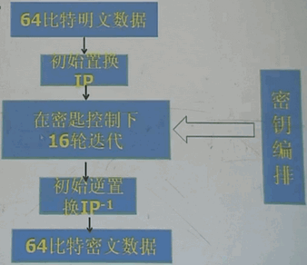
25. AES算法：明文分组128/256位，密文分组128/192/256位。密钥长度128位。
26. SPN结构，轮函数包含代换层，置换层，密钥混合层。10轮加密。
27. SMS4算法是中国颁布的第一个公开加密算法。明文和密文长度都是128位。广义Feistel结构。
28. 分组密码运行模式：电码本模式（ECB），密码反馈模式（CFB），密码分组链接模式（CBC），输出反馈模式（OFB），计数模式（CRT）。
29. DES安全性降低后，又有二重DES和三重DES（TDES）出现。
30. DES具体细节：
31. 先将明文的64比特串进行初始置换，置换后的分为前后32比特。
32. 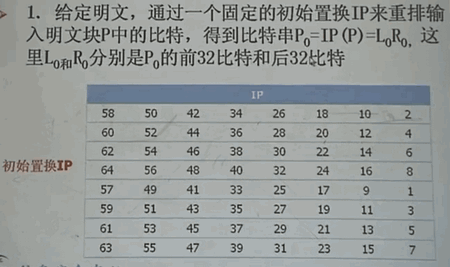 
33. $L_i=R_{i-1}$；$R_i=L_{i-1}\oplus f(R_{i-1},K_i)$。其中16个$K_i$是密钥K经过编排函数计算得到的。f成为轮函数。第16轮左右两块不交换。
34. 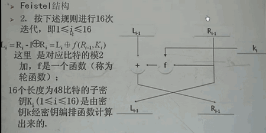
35. 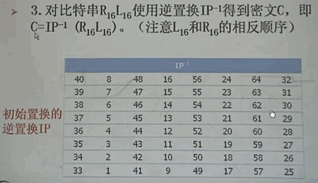
36. 轮函数输入为1个32比特的$R_{i-1}$，一个为48比特的子密钥$K_i$。输出为32比特。
37. 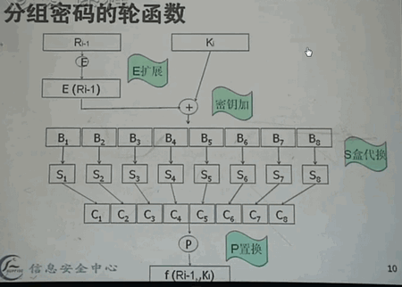
38. E扩展，将32比特扩展为48比特，有些比特重复了。
39. 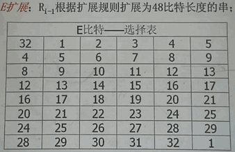
40. 密钥加是模二加运算，然后将48比特，切分为8段，每段6个比特。S盒代换将一个6比特的串变成4比特的串。
41. 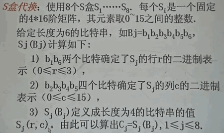
42. 8个S盒，进行对应的行列查找，然后替换。
43. 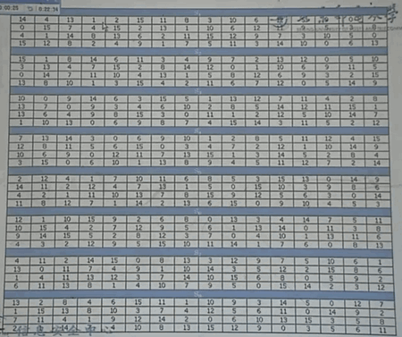
44. P置换：
45. 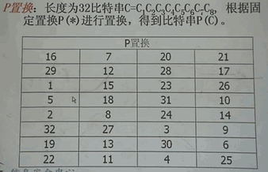
46. 密钥编排算法，可以先计算出来，然后批量进行加密和解密。
47. 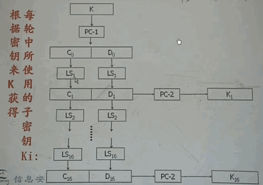
48. 64个比特进行PC-1处理时，只使用56个非校验位的比特。
49. 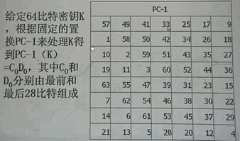
50. 循环左移
51. 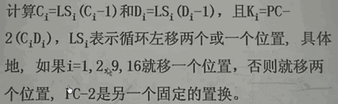
52. PC-2也是一个固定的置换，输入56位输出48位。
53. 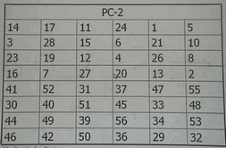
54. DES的解密和加密使用相同的算法，只是子密钥以相反的方式输入即可。密钥编排是公用的。这样设计的话硬件成本降低。
55. AES实现细节：AES的整体结构和DES差不多，不过操作都是基于方块的。
56. 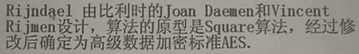
57. 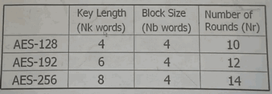
58. 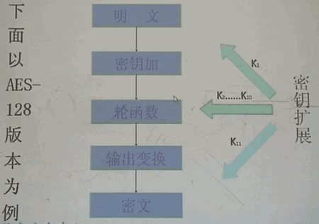
59. AES的轮函数，输入128比特，输出128比特。每一轮要做4种变换。
    1. 字节代换（Subbyte）
    2. 行移位（ShiftRow）
    3. 列混合（MixColumn）
    4. 密钥加（AddRoundKey）
60. 字节代换是非线性的，独立地对状态的每个字节进行，代换表（S盒）是可逆的，
61. state是待加密的明文，从左到右，从上到下来排列16个字节。右边是密钥。
62. 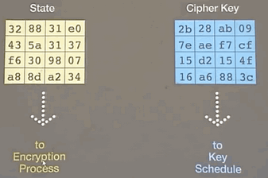
63. 先将128位放置到4x4的字节中，根据字节的前4位和后4位，来对S盒进行索引，例如19表示第一行，第9列，替换长d4。
64. 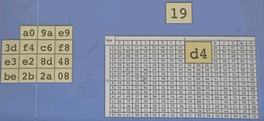
65. 一次字节代换后如下：
66. 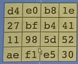
67. 然后进行行移位，第一行不变，第二行左移1个字节，第三行左移2个字节，第四行左移3个字节。
68. 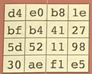
69. 列混合：每一列和一个固定的矩阵相乘。
70. 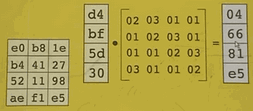
71. 密钥加，每一列和轮密钥模2加。
72. 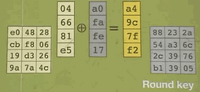
73. 然后再进行9轮。第10轮不进行列混合。
74. AES的密钥编排包含：密钥扩展，轮密钥选取。
75. 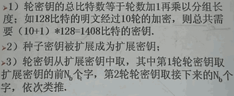
76. AES的解密变换是进行加密对应的操作的逆变换。
77. 分组密码算法的运行模式：
78. 明文的分组长度是固定的，但是待加密的内容是不定的。为了能在多种场合应用DES，规定了4种运行模式，ECB，CBC，CFB，OFB。后来来提出了AES的另一种运行模式CTR。
79. ECB electronic codebook 电码本模式，逐块加密，然后拼接，每次加密的密钥都相同。
80. 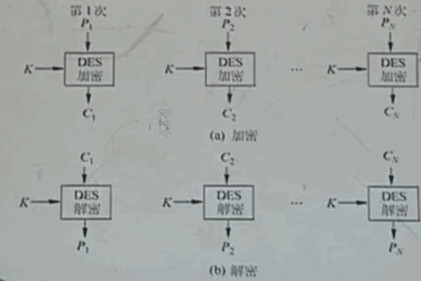
81. 如果明文的长度不是64比特的倍数，最后的一个进行填充，事先约定好的。
82. 密文块可以独立解密，明文中相同的64比特块，将产生相同的64比特密文块。不存在错误传播，即一个密文块出错只影响它对应的明文块。各块的加密和解密是独立的。
83. 该模式主要用于发送少数量的分组数据，因为如果数据量大的话， 破译者可能会根据统计规律进行破译，因为明文容易出现重复。
84. CBC cipher block chaining 密码分组链模式
85. 环环相扣。一次对一个明文分组进行加密，加密算法的输入时当前的明文分组和前一次密文分组的异或。
86. 加密和解密的都是从前向后进行，都要按照顺序进行。在产生第一个密文分组时，需要有一个初始向量来和第一个明文分组进行异或，解密时，也需要该向量。为了安全性最高，初始向量IV和密钥一样被保护，可以使用ECB模式来发送IV。如果攻击者使得接收方使用了错误的IV，则会导致第一个个密文块解密错误。
87. 密钥相同时，相同的明文块产生的密文块不相同。存在错误传播，某块密文传输错误，导致它之后的密文解密都出错，对纠错的要求更高。适合加密较长的信息。
88. 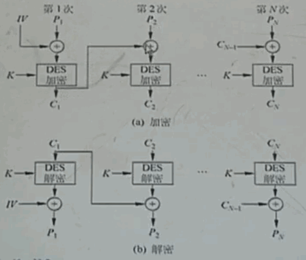
89. CFB cipher feedback 密文反馈模式：
90. OFB 输出反馈
91. 流密码（序列密码），一次加密一个比特。密钥流和明文一样长。对应比特进行异或即可完成加密。解密也是异或运算。如果密钥流是绝对随机的，那么该加密算法是绝对安全的。实际中只能使用伪随机序列来代替。难点在于如何产生随机性足够好的伪随机序列。由已知推断未知难度很大时，可以认为随机性好。
92. 这个就是一次一密，每个比特使用单独的密钥。
93. 一般都是用有限的种子密钥，产生任意长的随机密钥序列。
94. 流密码的核心内容是如何生成高效的伪随机数发生器。流密码的加密速度非常快，只要密钥流的生成速度足够快。
95. 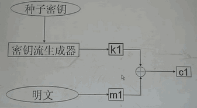
96. 以下性质是从真随机事件中总结出来的性质，也将其作为伪随机的必要条件。
97. 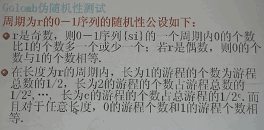
98. 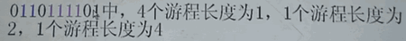
99. 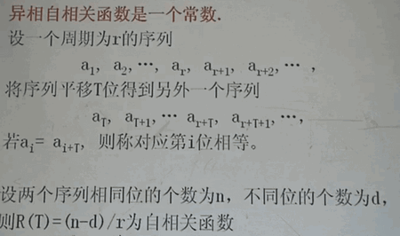
100. 单向函数：直到输入容易计算输出，但是知道输出很难计算输入。正向容易，反向困难。比特流作为输入和输出。
101. 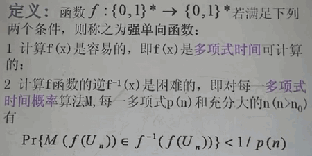
102. 单向函数是构造hash函数的一个重要思路。
103. hash函数：将任意长的输入，输出为固定长度的哈希值。不能是简单的截取消息，而是寻找指纹信息。
104. hash函数又称为散列函数，杂散函数等。
105. hash的概念起源于数据库的管理，使得数据库的查找可以在平均常数时间内完成。
106. 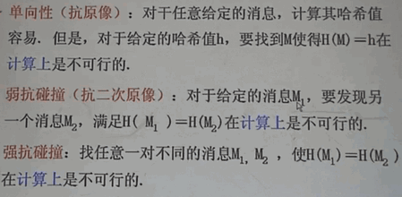
107. 理论上只要是hash值是有限长度的，那么就一定存在碰撞的消息，但是寻找出来在计算上是不可行的。
108. 弱抗碰撞和强抗碰撞的区别是前者M1是给定的，后者是任意寻找一对消息。
109. hash分类：以下函数正向容易，但是反向无法证明是不可行的。
110. 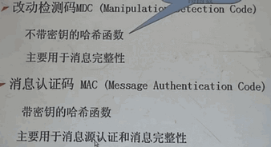
111. 哈希函数可以用于消息完整性检验，消息源认证码，数字签名，口令认证。
112. 实际的数字签名不是直接对文件进行，因为文件往往较大，而是对文件的hash值进行签名。
113. hash也用了迭代结构。消息先分块，然后前一块的输出作为下一块的输入。
114. 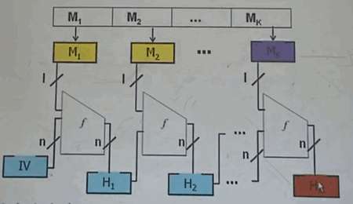
115. 散列函数MD（message digest）族（使用MD迭代结构）包含：md2,md4,md5都产生128位的摘要。
116. 散列函数还有一个系列是SHA系列，是根据md4和md5开发的，作为美国政府标准。S表示安全的意思。
117. 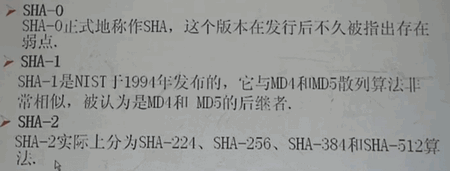

# 散列函数

1. 又称为哈希函数，特点如下：
   1. 无论的数据长短，计算总是得到一个定长的内容。
   2. 相同的输入，一定得到相同的输出。
   3. 正求哈希值很容易，反求则不可行。
2. 对一个好的散列函数来说，要找到两个不同的输入对应相同的输出（哈希碰撞），实际上是不现实的。就像数据的指纹。数据被修改后，它的散列值就会发生变化。
3. 哈希函数的应用有：
   1. 防止传输的密码泄露。登录网站时，会在本地将输入的密码进行哈希运算，然后上传到服务器，和服务器保存的注册时的密码的哈希值对比。及时网站被人盗取，密码的明文也不会被泄露，防止被用于撞库，因为一个人在大部分网站设置的密码都是一样的。

# 数字签名

1. 利用数字签名来识别身份：
   1. 利用发送方的私钥对内容进行加密（这一步成为签名）。
   2. 发送方把内容和签名后的内容一同发送给接收方。
   3. 接收方使用发送方声称的身份的公钥（公开获取的）解密，如果发现结果和内容相同，则可以认为发送方确实是拥有该公钥对应的私钥。即可判定发送方的身份。
2. 数字签名不仅可以识别身份，还可以确保内容的完整性，如果第三方篡改了内容，接收方在解密后发现结果和内容不符，即可认为该内容被篡改。当然也有可能是发送方并不是该公钥的拥有者，即身份不对。
3. 实际使用中，由于对大块内容进行签名耗费时间，一般是对内容的哈希值进行签名。接收方解密后，计算内容的哈希值，比较即可认定内容的完整性。
4. 公钥算法的两大应用就是：更安全的加密（加密和解密）和数字签名（签名和验证）。     这也是为什么公钥也被称作key的原因。
5. 数字签名需要内容和私钥，产生签名后的文件和签名信息        验证签名需要  公钥，签名后的文件和签名信息，结果为是否通过验证。
6. 数字签名的三大作用：
   1. 认证，确实文件是否为特定人签署。这也是最基本的作用。如果用他的公钥可以通过验证，那么就是他签名的。
   2. 防止抵赖，同上
   3. 防止篡改，签名的内容是要传输内容的哈希值。如果解密出来的哈希值和传输内容的对不上，那么内容就被修改了。        这个是纸笔签名不能做到的。
7. 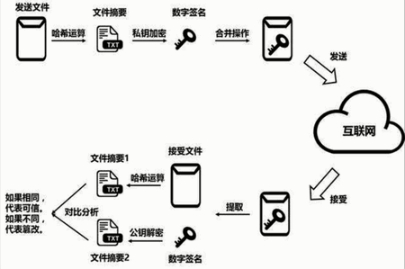
8. 私钥不能泄露，同时非对称算法要求不能通过一个公钥算出另一个私钥。反之亦然。
9. 非对称加密无法防止中间人攻击，公钥交换时，第三方将自己的公钥分发给了双方。这样双方发送的消息，第三方都能解密，然后可以进行修改后再发送给接收方。
10. 混合加密，分别用到了对称和非对称加密的优点。传输大量数据时，发送方生成一个对称密钥，然后用接收方的公钥加密该对称密钥，发送给接收方，接收方解密后获得对称密钥，之后双方使用对称密钥来传输大量数据。混合加密也会受到中间人攻击，因为他是用到了非对称加密。
11. 预防中间人攻击的可靠方法是选取一个可信的中间人。即CA。

# 消息认证码

1. 消息认证码使用对称加密，双方有两套密钥，一套用来加解密发送内容的密钥A，一套用来生成消息认证码的密钥B。这两个密钥要以安全的方式发送给对方，不能泄露。可以使用混合加密+CA的方式。
2. 发送方先用A密钥来加密要发送的内容，然后把密文和密钥B一起丢入哈希函数，计算得到消息认证码。再将密文和消息认证码一起发送给接收方。接收方收到后，用自己密钥B和收到的密文进行哈希运算，查看得到的结果和收到的消息认证码是否一致。如果一致，然后再用密钥A对密文进行解密。如果不一致，则丢弃。
3. 消息认证码可以防止篡改，因为第三方截获密文和消息认证码后，对密文或消息认证码修改，因为没有密钥B，所以无法保证修改后的密文和消息认证码对应。
4. 消息认证码还可以防止假冒身份，第三方因为没有密钥A和B，生成的密文和消息认证码，在接收方处，无法通过密钥B的检验。
5. 消息认证码加上随机数就可以预防==重放攻击==，重放攻击指的是，第三方截获消息后，不修改，而是多次给接收方发送消息，这样也有可能会导致问题出现。如果只是用之前的机制，接收方是无法判断发送方到底发送了多少次。
   1. 为了预防重放攻击，发送方再生成消息认证码时，除了加入密钥B，还加入一个随机数，将密文，随机数，消息认证码一起发出去。每条消息都是用不同的随机数。这样接收方在收到后，只要观察到随机数相同的包，就丢弃后到的。
   2. 还有一种加入随机数的方法是，把随机数加入到要加密的明文中，生成消息认证码和之前一样，这样接收方就需要解密后才能看到随机数，判断是否为存在重放。